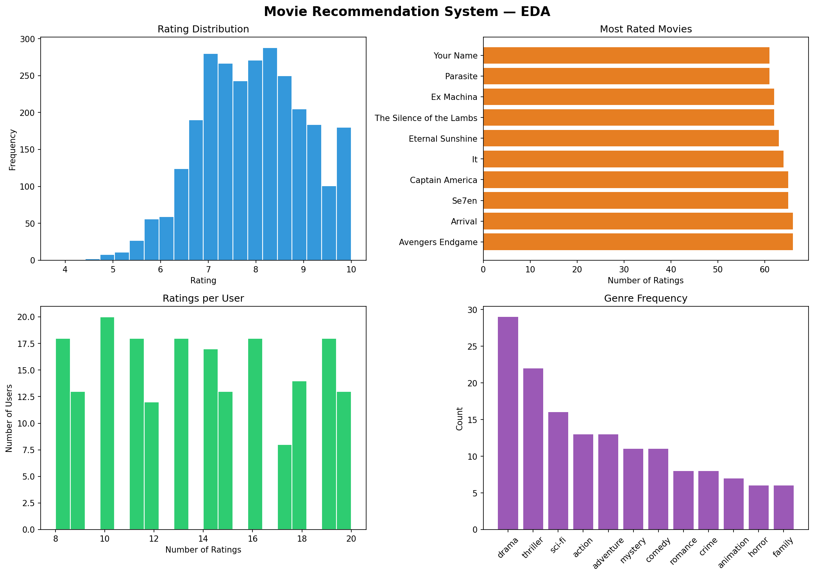

# 🎬 Movie Recommendation System

> A complete, end-to-end recommendation engine built in Python — combining Content-Based Filtering, Collaborative Filtering, SVD Matrix Factorisation, and a Hybrid system to suggest movies users will love.


---

## 📌 Project Overview

This project was built as **CV Portfolio Project #2** to demonstrate proficiency in building recommendation systems from scratch — one of the most impactful and widely deployed applications of machine learning (used by Netflix, Spotify, Amazon, and YouTube).

We work with a synthetic dataset of **50 movies**, **200 users**, and ~**2,800 ratings**, designed to mirror the sparsity and variability of real-world movie rating platforms.

---

## 🗂️ Repository Structure
movie-recommendation-system/

├── movie_recommendation_system.ipynb   ← Main notebook (fully commented)

├── recommendation_eda.png              ← 4-panel EDA dashboard

├── svd_variance.png                    ← SVD explained variance chart

├── requirements.txt                    ← Python dependencies

└── README.md                           ← This file
---

## 🧠 Techniques Implemented

| System | Technique | How It Works |
|--------|-----------|-------------|
| **Content-Based** | TF-IDF + Cosine Similarity | Recommends movies with similar genre profiles |
| **Collaborative** | User-User Similarity | Recommends what similar users enjoyed |
| **Matrix Factorisation** | Truncated SVD | Decomposes the rating matrix to predict unseen ratings |
| **Hybrid** | Weighted Score (alpha) | Blends content and collaborative signals |

---

## 📦 Dataset

| Property | Value |
|----------|-------|
| Movies | 50 titles across 8+ genres |
| Users | 200 simulated users |
| Ratings | ~2,800 individual ratings |
| Sparsity | ~72% (most users rate only 8–20 movies) |
| Rating Scale | 1.0 – 10.0 |

> No external data file needed — the dataset is generated inside the notebook using `numpy` with a fixed random seed for full reproducibility.

---

## 🔍 How Each System Works

### 1. Content-Based Filtering
- Converts movie genres into TF-IDF vectors
- Computes cosine similarity between every pair of movies
- Returns the top-N most genre-similar movies for any given title

### 2. Collaborative Filtering
- Builds a user-item rating matrix (200 users × 50 movies)
- Computes user-user cosine similarity
- Finds each user's 10 nearest taste neighbours
- Recommends movies the neighbours loved that the user has not seen

### 3. SVD Matrix Factorisation
- Splits ratings into 80% train / 20% test
- Decomposes the training matrix: **A ≈ U × Σ × Vt** (20 latent components)
- Reconstructs the full matrix to predict all missing ratings
- Evaluates on the test set using RMSE and MAE

### 4. Hybrid System
hybrid_score = alpha × content_score + (1 − alpha) × collaborative_score
- `alpha = 0.6` by default (60% content, 40% collaborative)
- Both scores are normalised to [0, 1] before combining
- Falls back to content-based if the candidate lists do not overlap

---

## 📊 EDA Dashboard



Four panels covering:
- **Rating Distribution** — shape and spread of all user ratings
- **Most Rated Movies** — which titles have the most user engagement
- **Ratings per User** — how active users are (cold-start risk)
- **Genre Frequency** — which genres dominate the catalogue

---

## 📏 Evaluation Results

| Metric | Description | Result |
|--------|-------------|--------|
| **RMSE** | Root Mean Squared Error on held-out test ratings | Run notebook to see |
| **MAE** | Mean Absolute Error on held-out test ratings | Run notebook to see |

---

## 🚀 How to Run

```bash
# 1. Clone the repository
git clone https://github.com/<umairrana99>/movie-recommendation-system.git
cd movie-recommendation-system

# 2. Install dependencies
pip install -r requirements.txt

# 3. Launch the notebook
jupyter notebook movie_recommendation_system.ipynb

# 4. Run all cells
# Kernel → Restart & Run All
```

---

## 📋 Requirements
pandas>=2.0.0

numpy>=1.24.0

scikit-learn>=1.3.0

matplotlib>=3.7.0

seaborn>=0.12.0

scipy>=1.11.0

jupyter>=1.0.0
---

## 🔬 Research Questions Explored

1. Can genre-based TF-IDF similarity reliably surface movies a user would enjoy?
2. Does user-user collaborative filtering produce more personalised results than content-based filtering?
3. How many SVD latent components are needed to capture the majority of the rating signal?
4. At what value of `alpha` does the hybrid system perform best?
5. How does sparsity (~72% missing ratings) affect prediction quality?

---

## 🚧 Future Work

- [ ] Swap synthetic data for a real dataset (MovieLens 100K from GroupLens)
- [ ] Replace genre TF-IDF with word2vec embeddings on plot summaries
- [ ] Implement Surprise SVD++ or Neural Collaborative Filtering
- [ ] Add Precision@K and Recall@K evaluation metrics
- [ ] Build a Streamlit web app for interactive recommendations
- [ ] Add item-item collaborative filtering as a comparison baseline

---

## 👤 Author

**[Umair Ali]**
[LinkedIn](www.linkedin.com/in/umair-ali99) · [GitHub](https://github.com/umairrana99)

---

## 📄 License

This project is open source under the [MIT License](LICENSE).
